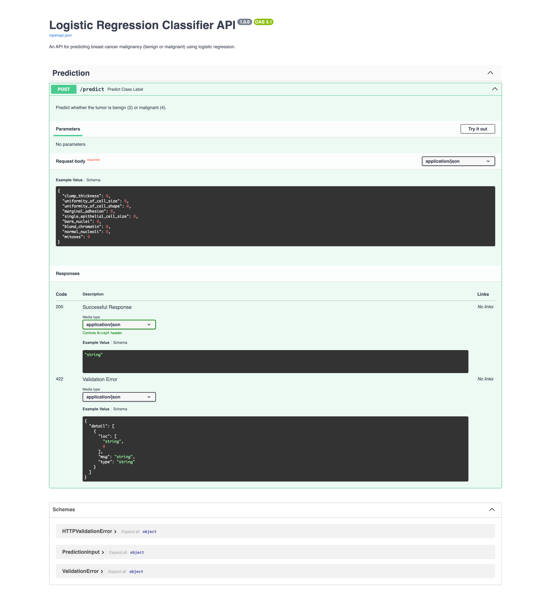

# Breast Cancer Prediction
Breast Cancer Prediction using Logistic Regression, FastAPI, and Streamlit App

## Table of Contents
- [Description](#description)
- [Requirements](#requirements)
- [Getting Started](#getting-started)
  - [1. Train and Save the Model](#1-train-and-save-the-model)
  - [2. Deploy FastAPI](#2-deploy-fastapi)
  - [3. Run Streamlit](#3-run-streamlit)
- [Usage](#usage)
- [Endpoints](#endpoints)
- [Example Input and Output](#example-input-and-output)
- [File Structure](#file-structure)
- [License](#license)

## Description

This project provides an API and a Streamlit application for predicting whether a tumor is benign (class = 2) or malignant (class = 4) using a Logistic Regression model. The model is trained on the following features:

- Clump Thickness
- Uniformity of Cell Size
- Uniformity of Cell Shape
- Marginal Adhesion
- Single Epithelial Cell Size
- Bare Nuclei
- Bland Chromatin
- Normal Nucleoli
- Mitoses

The API is deployed using FastAPI, and a Streamlit app provides an interactive interface for users to input values and get predictions.


## Requirements
To set up and run this project, you’ll need the following Python packages:

- `fastapi`
- `uvicorn`
- `scikit-learn`
- `pandas`
- `joblib`
- `numpy`
- `streamlit`

You can install these dependencies by running:
```bash
pip install -r requirements.txt
```

## Getting Started
Follow these steps to set up and run the project.

1. Train and Save Model

  Train the Logistic Regression model using Scikit-Learn and save the trained model and scaler to files for deployment:
  ```bash
  python logistic_regression_model.py
  ```
  This will create the `model.pkl` and `scaler.pkl` files in the `model/` directory.

2. Deploy FastAPI
The FastAPI application (`api.py`) loads the saved model and provides an endpoint for predictions. Run it using `uvicorn`:
  ```bash
  uvicorn api:app --reload
  ```
This will start the FastAPI server at `http://127.0.0.1:8001`

3. Run Streamlit
The Streamlit app allows users to input values and retrieve predictions from the FastAPI server. To start Streamlit, run:
  ```bash
  streamlit run app.py
  ``` 
The Streamlit app will open in a browser window at `http://localhost:8501`.

## Usage

FastAPI Endpoints


- POST /predict
  - Description: Accepts environmental parameters and returns a predicted class of tumor benign (2) or malignant (4).
  - Input JSON:
  ```bash
  {
    "clump_thickness": 1,
    "uniformity_of_cell_size": 2,
    "uniformity_of_cell_shape": 3,
    "marginal_adhesion": 4,
    "single_epithelial_cell_size": 5,
    "bare_nuclei": 6,
    "bland_chromatin": 7,
    "normal_nucleoli": 8,
    "mitoses": 9
  }
  ```
  - Output JSON:
  ```bash
  {
    "prediction": 4,
    "label": "Malignant"
  }
  ```
  
### Streamlit Application

The Streamlit app provides an interface for users to input feature values and get predictions. When the Predict button is clicked, the app sends the data to the FastAPI server and displays whether the tumor is benign or malignant.

## Example Input and Output
Example Input:

Clump Thickness = 5  
Uniformity of Cell Size = 3  
Uniformity of Cell Shape = 3  
Marginal Adhesion = 2  
Single Epithelial Cell Size = 3  
Bare Nuclei = 4  
Bland Chromatin = 3  
Normal Nucleoli = 2  
Mitoses = 1 

Example Output:

Prediction: 2  
Label: Benign 


## File Structure
The project directory is structured as follows:

```
📦 logistic_regression_classifier
├─ data
│  └─ data.csv
├─ model
│  ├─ model.pkl
│  └─ scaler.pkl
├─ src
├─ .gitignore
├─ app.py
├─ api.py
├─ logistic_regression_model.py
├─ README.md
└─ requirements.txt
```
## License
This project is licensed under [](https://opensource.org/licenses/MIT)